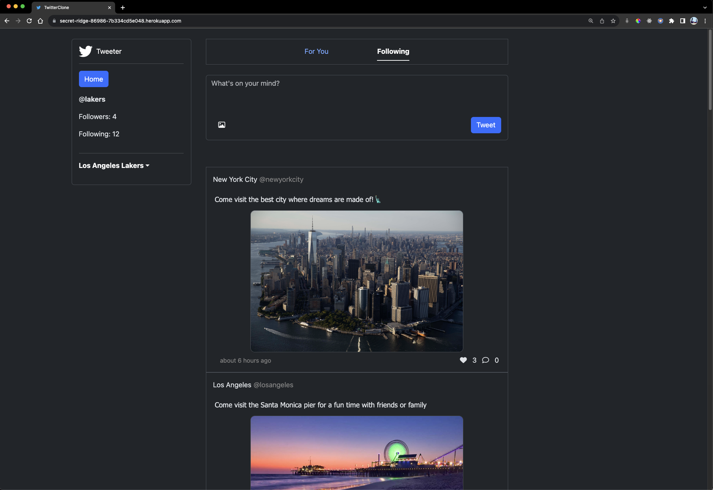
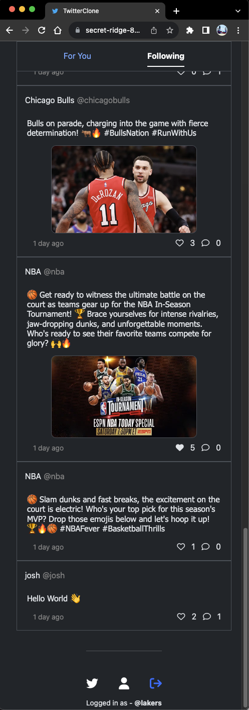

# Tweetter (Twitter Clone)

## Technologies Used:

- Ruby
- Ruby on Rails
- ERB (Embedded Ruby)
- Bootstrap
- PostgreSQL
- Heroku

### Live link [here](https://secret-ridge-86986-7b334cd5e048.herokuapp.com/)

### Why a Twitter Clone?

For this project, I wanted to learn Ruby and didn't want to deal with coming up with an idea for a web app. I chose Twitter because it is something that I use daily and is fairly simple.
Once you start to design and map out the key features of Twitter it can get very complex, for example, the trending words or hashtags. The basic CRUD operations of the whole app were very straight forward though.

## Experience with Ruby

When getting started with Ruby on Rails, which covers both the backend and frontend sides, I needed to get a feel for Ruby. At first, the syntax of Ruby compared to a popular language like Javascript, but once you dive a little deeper it is actually very easy to write and understand. This was great for someone new to this language, it took me about a day and a half for me to be comfortable with the syntax. Overall, I think Ruby is great, especially the fact that is an Object-oriented language but also has its pros and cons to it.

## Experience with Rails

On the other hand, I had a very mixed opinion of Rails. It started with me having a ton of errors when installing and setting up rails. This was a very frustrating and long process, that took many years off my life. The cool thing about Rails is that you can create a CRUD app in about 15 minutes with the built-in rails commands. If you are doing something more complex, you might be fighting with the framework rather than working with it. For me, this led to errors with the HTTP requests. Overall, this was a great project for me to learn a new tech stack (even though it seems to be dying in popularity) and get more experience with web development.
